# OKN Social Command Center (OKN Social OS)
## Master Architectural Blueprint & End-to-End Operations Manual

**Ecosystem Targets:**
- 🪙 **OKN Token**: [https://okntoken.com](https://okntoken.com)
- ⚡ **OKNEXUS Exchange**: [https://oknexusexchange.com](https://oknexusexchange.com)
- 📂 **GitHub Repository**: [lovethmykel-ui/oknsocials](https://github.com/lovethmykel-ui/oknsocials)
- 🔒 **Default Security Passcode**: `1234`
- 📄 **Downloadable PDF Blueprint**: [`/OKN_Social_OS_Master_Blueprint.pdf`](file:///c:/Users/DORATHY/UI%20UX%20Skill/oknsocials/public/OKN_Social_OS_Master_Blueprint.pdf)

---

## 1. System Architecture & Component Hierarchy

```mermaid
graph TD
    A[User / Executive Browser] --> B[Apple-Style Passcode Gate: PIN 1234]
    B --> C[Master App Shell: src/app/page.tsx]
    
    subgraph Shell Layer
        C --> S[Enterprise Desktop Sidebar]
        C --> H[Top Header with UTC Clock & Search]
        C --> M[Mobile Liquid Glass Dock]
        C --> CP[Command Palette: Cmd+K]
        C --> ND[Flyout Notification Center]
    end

    subgraph 12 Interactive Workspaces
        C --> W1[1. Command Center Dashboard]
        C --> W2[2. AI Social Director]
        C --> W3[3. Unified Inbox 3-Pane]
        C --> W4[4. Content Studio Adaptive Composer]
        C --> W5[5. Content Calendar]
        C --> W6[6. Campaign Builder]
        C --> W7[7. Media Vault]
        C --> W8[8. Executive Analytics]
        C --> W9[9. Social Accounts Manager]
        C --> W10[10. AI Agent Matrix 12 Agents]
        C --> W11[11. Project AI Brain]
        C --> W12[12. System & Database Settings]
    end

    subgraph Intelligence & Safety Engine
        W4 --> GAPI[Live Google Gemini 2.0 API Route]
        W4 --> SE[Sentinel 4-Tier Risk Classifier]
        W3 --> AIResp[Brand-Voice Response Generator]
        W11 --> PBR[Policy & Forbidden Claims Enforcer]
    end

    subgraph Data & Storage Layer
        C --> SUPA[(Supabase PostgreSQL 15 Tables + RLS)]
        C --> STAT[Dynamic React State + Local Storage]
    end
```

---

## 2. Complete Module Blueprint & Capabilities

### 1. Command Center Dashboard
- **Executive Metrics**: Total Reach, Engagement Rate, Community Size, AI Autonomous Decisions.
- **Contextual Status**: Real-time operational indicator for both OKN Token and OKNEXUS Exchange.
- **Setup Checklist**: Step-by-step guidance for connecting accounts, creating posts, and running campaigns.
- **Pipeline Snapshot**: Immediate overview of queued releases and unread community conversations.

### 2. AI Social Director
- **Operational Intelligence Center**: 9-capability matrix (Dynamic Gating, Strategic Timing, Sentiment Analysis, Threat Interception, etc.).
- **Live Autonomous Decision Feed**: Timestamped stream of actions taken by AI agents with confidence scores.
- **Reasoning Inspector**: Explains the exact policy rationale behind every decision.

### 3. Unified Inbox
- **3-Pane Workflow**: Category filters (Unread, Needs Approval, Flagged) → Thread list → Full conversation context.
- **7-Platform Aggregation**: X, Instagram, LinkedIn, Telegram, YouTube, TikTok, Facebook.
- **Automated Triage**: Sentiment classification (Positive, Neutral, Critical) and intent tagging (Product Question, Scam Alert, Partnership).
- **AI Suggested Brand Response**: Generates compliant replies on demand with 1-click insertion into the composer.

### 4. Content Studio (Adaptive Multi-Channel Composer)
- **Unified Concept Input**: Write a single raw narrative hook.
- **✦ AI Adapt via Gemini**: Synthesizes 7 platform-specific copies in parallel via live Google Gemini AI.
  - **X**: 280-char punchy post with hashtags and CTA signal.
  - **Instagram**: Rich caption with spacing, bio link CTA, and 8+ hashtags.
  - **LinkedIn**: Professional format with numbered insights and discussion prompt.
  - **Telegram**: Formatted community announcement with bold markdown.
  - **YouTube / TikTok / Facebook**: Tailored metadata, hooks, and timestamps.
- **Live Platform Previews**: Pixel-accurate dark preview cards for X, Instagram, LinkedIn, and Telegram.
- **Sentinel Safety Evaluator**: Pre-publish gating that checks forbidden claims and speculative promises.
- **Celebration Feedback**: Confetti explosion on publish.

### 5. Content Calendar
- **Release Scheduling**: Plan posts across dates and time slots.
- **View Modes**: Toggle between Month grid, Week view, and List agenda.
- **Platform Badging**: Visual indication of target platforms for each release.

### 6. Campaign Builder
- **Multi-Stage Structure**: Teaser → Educational → Launch → Community → Follow-up.
- **Milestone Tracking**: Budget allocation, target reach progress bars, and scheduled deliverables.

### 7. Media Vault
- **Asset Categories**: Logos, 3D Renders, Social Graphics, Videos, Flyers.
- **Metadata Inspector**: Aspect ratios (1:1, 16:9, 9:16, 4:5), dimensions, file sizes, and quick-attach links.

### 8. Executive Analytics
- **SVG Area & Bar Charts**: Reach and impressions trends across 7d, 30d, and 90d intervals.
- **Audience & Platform Breakdown**: Distribution percentages across social channels.
- **Velocity Metrics**: Engagement spikes and response speed tracking.

### 9. Social Accounts Manager
- **Interactive Account Connection**: Add custom handles, toggle platform permissions (Publish, Read Inbox, Auto-Reply, Analytics).
- **Health Diagnostics**: Real-time status indicators (Healthy, Attention Needed, Rate Limited).
- **Follower Baselines**: Live aggregate count for both OKN Token and OKNEXUS Exchange.

### 10. AI Agent Matrix (12 Specialized Agents)
- **Full Roster**: Social Director, Content Architect, Inbox Intelligence, Comment Moderator, Community Liaison, Sentinel Threat Interceptor, Analytics Engine, Release Scheduler, Campaign Operations, Trend Scout, Influencer Scout, and Account Health Monitor.
- **Granular Autonomy Control**: Toggle each agent between `OFF`, `SUGGEST ONLY`, `APPROVAL REQUIRED`, and `AUTONOMOUS`.

### 11. Project AI Brain
- **Knowledge Base Rules**: Official websites ([https://okntoken.com](https://okntoken.com) and [https://oknexusexchange.com](https://oknexusexchange.com)).
- **Approved Claims**: Official value propositions and capabilities.
- **Forbidden Claims Guard**: Strict blacklist blocking promises of financial returns, unregistered securities claims, and scam vectors.

### 12. System Settings & Security
- **Security PIN**: Built-in passcode protection (`1234`).
- **Supabase Integration**: 15 PostgreSQL tables with Row Level Security.
- **Audit Logs**: Immutable log of administrative actions and AI agent permissions.

---

## 3. Operations Manual — How to Use Every Feature

### Step 1: Unlocking the Command Center
1. Open the application URL in your browser (`http://localhost:3000` or your Vercel deployment).
2. Enter the 4-digit PIN: **`1234`**.
3. Upon success, the green shield will confirm and unlock your session.

### Step 2: Switching Ecosystem Projects
1. In the left sidebar header, click the project badge (e.g. **OKNEXUS Exchange**).
2. Select **OKN Token** or **OKNEXUS Exchange** from the dropdown.
3. All workspaces instantly re-contextualize to the selected entity.

### Step 3: Connecting Your Social Accounts
1. In the sidebar, click **Social Accounts**.
2. Click the blue **"Connect Social Account"** button.
3. Select your platform (e.g. X, Telegram, Instagram).
4. Enter your handle (e.g. `@OKNToken` or `@OKNEXUS`), follower count, and choose an automation level.
5. Click **"Save Account"**. The new account will immediately appear in your active fleet.

### Step 4: Generating and Publishing Content with Gemini AI
1. Go to **Content Studio**.
2. Type or paste your concept into the narrative textarea:
   > *"OKNEXUS perpetual DEX liquidity vaults are officially opening with zero counterparty drag at https://oknexusexchange.com"*
3. Click **"✦ AI Adapt via Gemini"**.
4. Gemini will generate optimized copies for all 7 channels in ~1 second.
5. Click between **X**, **Instagram**, **LinkedIn**, and **Telegram** tabs to preview the exact post layout.
6. Click **"Publish All Now"** to finalize.

### Step 5: Handling Inquiries in the Unified Inbox
1. Go to **Unified Inbox**.
2. Select any incoming inquiry from the conversation list.
3. Review the AI intent tag (e.g., *Product Question*) and sentiment indicator.
4. Click **"Insert into Composer"** under the *AI Suggested Brand Response* card.
5. Edit or refine the reply, then click the **Send** button.

---

## 4. Official Ecosystem Links Reference

| Entity | Official Website | Social Focus |
|---|---|---|
| **OKN Token** | [https://okntoken.com](https://okntoken.com) | Utility, ecosystem rewards, governance, staking |
| **OKNEXUS Exchange** | [https://oknexusexchange.com](https://oknexusexchange.com) | Perpetual DEX, institutional liquidity, sub-ms execution |
| **Command Center Repo** | [https://github.com/lovethmykel-ui/oknsocials](https://github.com/lovethmykel-ui/oknsocials) | Next.js 16 App Router codebase |
